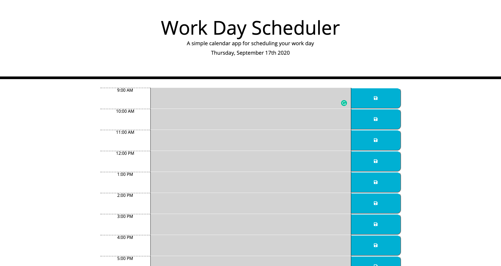

# Work_Day_Scheduler

## Description

This is a simple calendar application that allows the user to save events for each hour of the day. This app runs in the browser and features dynamically updated HTML and CSS powered by jQuery.

-------------

## Deployed App

Link to deployed app: [Work Day Scheduler](https://crowandrew.github.io/Work_Day_Scheduler/)

-------------

## Visuals
 
 Screenshot of initial screen



-------------

## Deep dive into the JS Code used.

### Below I will break down the code for the `script.js` that handles most of the logic:

(Click on the triangle to see the code and a more detailed description of what is happening.)

<details>
<summary>Defining to variables for current date and time</summary>
<p>In this section we are defining two global variables for current date and time.</p>

```javascript
const currentDay = $("#currentDay").text(moment().format("dddd, MMMM Do YYYY"))
const currentTime = moment().format("H");
```

</details>


<details>
<summary>Initializing page</summary>
<p>This is just calling the renderTimeBlocks() to build the initial page<p>

```javascript
renderTimeBlocks();
```

</details>

<details>
<summary>Rendering each time block</summary>
<p>This function is creating running a loop 9 times and starting with an index of 9. For each loop it is creating a div with a class of "row time-block", then creating a div with a class of col-2 hour and for of textArea and index. Next, we are creating a text area with a class of "col-8 description" and creating a button with a class of "col-2 saveBtn fas fa-save", an id of button and index. When then create a variable areaMod which is the string of #textArea append with the index. We will use to the identify the text areas for other functions. We then append the div, text area and button to the row div. Now we append the whole row to the div with the class of container. Lastly, we call three functions renderHour(), setTimeBlocks() and renderStoredTasks(0). For each function we pass in the index and the area in each block that the function needs.</p>

```javascript
function renderTimeBlocks() {
    for (let i = 9; i < 18; i++) {
        const newRow = $("<div>").addClass("row time-block");
        const newTimeBox = $("<div>").addClass("col-2 hour");
        const newDescription = $("<textarea>").addClass("col-8 description").attr("id", "textArea" + i);
        const newButton = $("<button>").addClass("col-2 saveBtn fas fa-save").attr("id", "button" + i);
        let areaMod = "#textArea" + i;
        $(newRow).append(newTimeBox, newDescription, newButton);
        $(".container").append(newRow);
        renderHour(newTimeBox, i);
        setTimeBlocks(areaMod, i);
        renderStoredTasks(areaMod, i);
    };
}
```

</details>


<details>
<summary>Grabs any tasks loaded in local storage</summary>
<p>This tasks looks for any task loaded in storage and is passed text area that corresponds to the index from the loop. The loads the value from local storage to the text area.</p>

```javascript
function renderStoredTasks(areaMod, i) {
    $(areaMod).text(localStorage.getItem(i));
}
```

</details>

<details>
<summary>Storing the task in local storage</summary>
<p>This function is grabbing the id of the button and slicing off the first 6 digits to just get the numbers at the end of the id. Then it grabs the text from inside the corresponding text area for that id and storing this text value in local storage. Lastly, it is calling the renderStoredTasks() function to render the new text to the page.</p>

```javascript
function storeTask(buttonId) {
    let num = buttonId.slice(6);
    let inputText = $("#textArea" + num).val();
    localStorage.setItem(num, inputText);
    renderStoredTasks(inputText, num);
}
```
</details>

<details>
<summary>Sets the hour for each time block</summary>
<p>This function set the hour for each time block it is using the index as the hour and attaching ":00" and AM / PM.</p>

```javascript
function renderHour(newTimeBox, i) {
    if (i < 12) {
        newTimeBox.text(i + ":00 AM");
    } else if (i === 12) {
        newTimeBox.text(i + ":00 PM")
    } else {
        let tempTime = i - 12;
        newTimeBox.text(tempTime + ":00 PM");
    };
}
</details>


<details>
<summary>Checks the current time and sets a class for past, present or future</summary>
<p>This function is checking the current time and comparing it to the index and setting a class that will change the background color depending on if the index is in the past, present or future compared to the current time.

```javascript
function setTimeBlocks(areaMod, i) {
    if (currentTime == i) {
        $(areaMod).addClass("present");
    } else if (currentTime > i) {
        $(areaMod).addClass("past");
    } else {
        $(areaMod).addClass("future");
    }
}
```
</details>

<details>
<summary>Event listener for the save buttons</summary>
<p>This is listening for a click on any button. When a click happens it is passing the button id into the storeTask() function.</p>

```javascript
$(".saveBtn").on("click", function (event) {
    event.preventDefault();
    storeTask(event.target.id)
})
```
</details>

-------------

## Author

Andrew Crow

-------------

## License

MIT License

Copyright (c) 2020 Andrew Crow

Permission is hereby granted, free of charge, to any person obtaining a copy
of this software and associated documentation files (the "Software"), to deal
in the Software without restriction, including without limitation the rights
to use, copy, modify, merge, publish, distribute, sublicense, and/or sell
copies of the Software, and to permit persons to whom the Software is
furnished to do so, subject to the following conditions:

The above copyright notice and this permission notice shall be included in all
copies or substantial portions of the Software.

THE SOFTWARE IS PROVIDED "AS IS", WITHOUT WARRANTY OF ANY KIND, EXPRESS OR
IMPLIED, INCLUDING BUT NOT LIMITED TO THE WARRANTIES OF MERCHANTABILITY,
FITNESS FOR A PARTICULAR PURPOSE AND NONINFRINGEMENT. IN NO EVENT SHALL THE
AUTHORS OR COPYRIGHT HOLDERS BE LIABLE FOR ANY CLAIM, DAMAGES OR OTHER
LIABILITY, WHETHER IN AN ACTION OF CONTRACT, TORT OR OTHERWISE, ARISING FROM,
OUT OF OR IN CONNECTION WITH THE SOFTWARE OR THE USE OR OTHER DEALINGS IN THE
SOFTWARE.